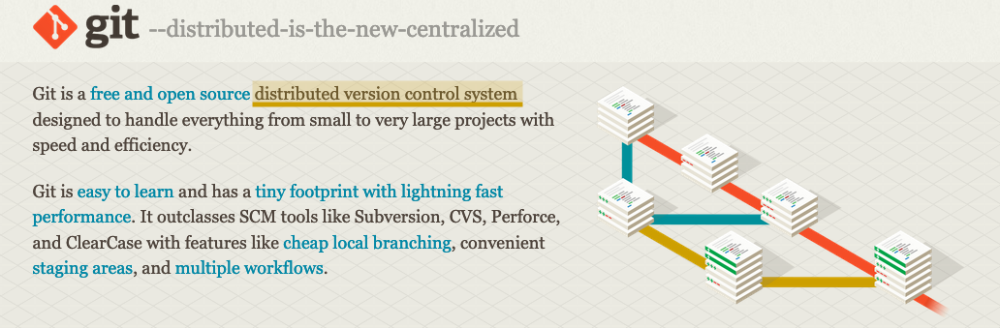
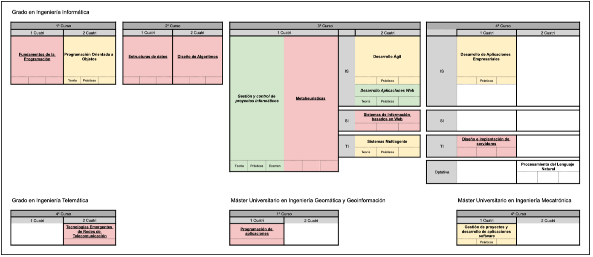
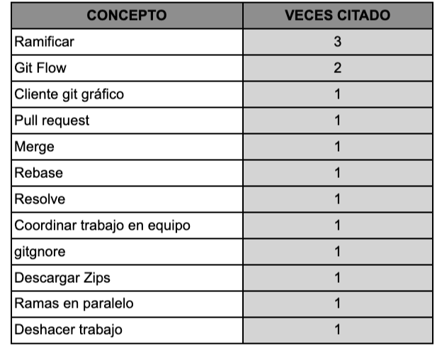
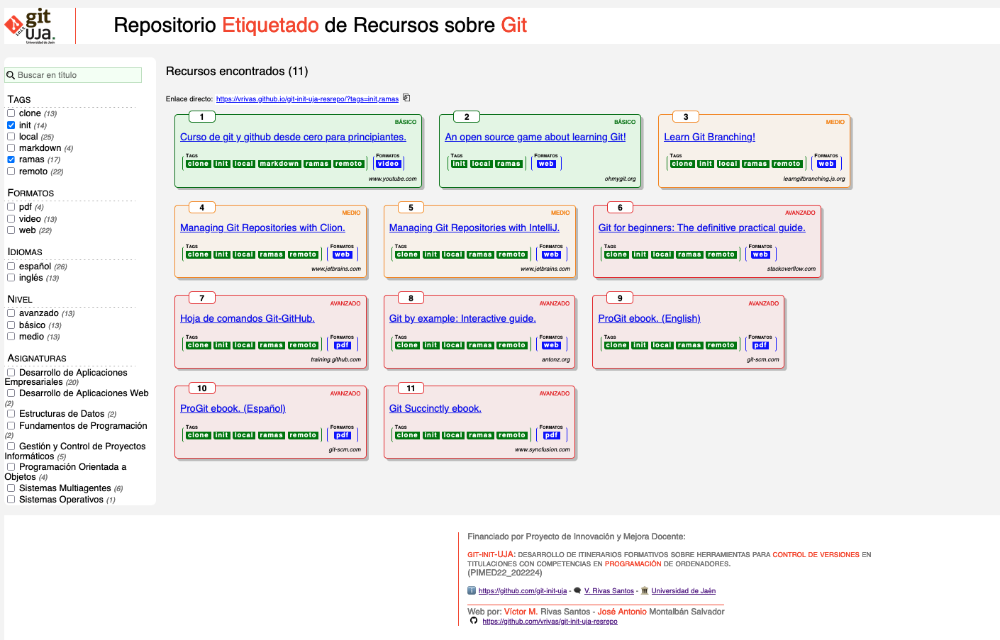
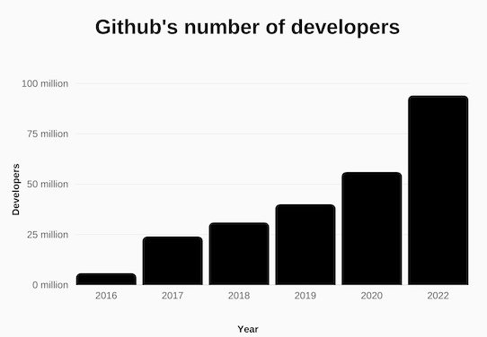
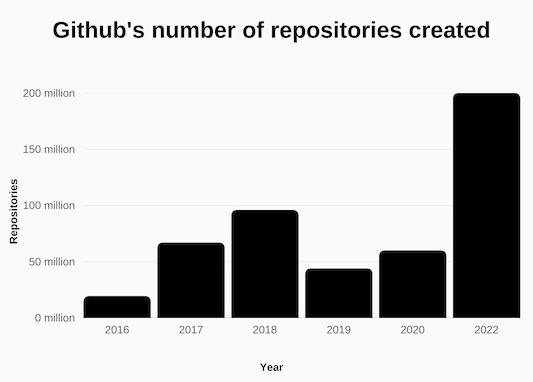
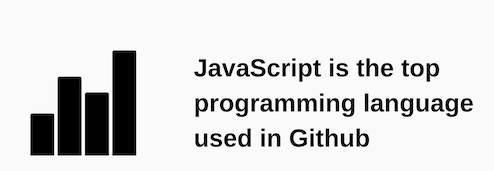

# Proyecto coordinado para la enseñanza de la herramienta Git en titulaciones de Grado y Máster
### III Jornada de Intercambio de Experiencias Docentes de la EPSJ
04-sep-2024

___

## Participantes: 
* Ángel Inocencio Aguilera García (Dpto. Informática)
* José Joaquín Aguilera García (Dpto. Informática)
* José Ramón Balsas Almagro (Dpto. Informática)
* Cristóbal José Carmona Del Jesus (Dpto. Informática)
* Lina Guadalupe García Cabrera (Dpto. Informática)
* Ángel Luis García Fernández (Dpto. Informática)
* Manuel García Vega (Dpto. Informática)
* Luis Martínez López (Dpto. Informática)
* Francisco Mata Mata (Dpto. Informática)
* Lidia Ortega Alvarado (Dpto. Informática)
* María Dolores Pérez Godoy (Dpto. Informática)
* Víctor M. Rivas Santos (Dpto. Informática) 🎤
* Antonio Jesús Rivera Rivas (Dpto. Informática)
* Ildefonso Ruano Ruano (Dpto. Ingeniería de Telecomunicación)
* Antonio Jesús Rueda Ruiz (Dpto. Informática)
* Pedro José Sánchez Sánchez (Dpto. Informática)
* Luis Alfonso Ureña López (Dpto. Informática)

___

## ¿Qué queremos?

*Distribuir la adquisición de competencias en la herramienta **Git** entre las distintas asignaturas que participan en el proyecto PIMED22_202224.*

**Ilustración 1.** ¿Qué es Git? (https://git-scm.com, 27-ago-2024).

---

## ¿Cómo pretendemos hacerlo?
<pre style="text-align: left; line-height: 0.9em;">
       +-----------------+       +---------------+       +--------------+
       |                 |       |               |       |              |
 +---->| ¿Dónde estamos? | ----> | ¿Dónde vamos? | ----> | ¿Cómo vamos? | --->---+
 |     |                 |       |               |       |              |        |
 |     +-----------------+       +---------------+       +--------------+        |
 |                                                                               |
 |                                                                               |
 +---------------------------------------<---------------------------------------+
</pre>

1. Medimos qué sabe de Git el estudiantado actualmente.
2. Medimos qué estamos enseñando de Git actualmente y qué es lo que más les cuesta aprender.
3. Consensuamos cómo podriamos introducir los distintos aspectos de Git en las asignaturas que impartimos.
4. Modificamos nuestras guías docentes para intentar reflejar dichos acuerdos.
5. Volvemos a medir en qué medida han afectado estas medidas al conocimiento y uso de Git por parte del alumnado.

---

## ¿Cómo lo financiamos?

Proyecto de Innovación y Mejora Docente de la Universidad de Jaén.
<pre>
    “git-init-UJA: desarrollo de itinerarios formativos sobre herramientas 
    para control de versiones en titulaciones con competencias en 
    programación de ordenadores. (PIMED22_202224)”
</pre>

* Solicitado en diciembre de 2022 para ser ejecutado durante los cursos 23/24 y 24/25.
* 17 docentes (+2 de colaboradores), 16 asignaturas, 4 titulaciones (grado y master).
* Dotado con 1.795,00€. 
    * Ícaro: 795,00€.
    * Difusión: 1.000,00€.

---

## ¿Qué resultados hemos obtenido hasta ahora?

### a) 🙂 -  Mapa del estado actual de la enseñanza de Git 

**Ilustración 2**. Mapa de uso de Git en las distintas titulaciones involucradas en el proyecto. En rojo, negrita y subrayado las asignaturas donde no se hace uso de Git. En amarillo, negrita y sin subrayar las que hacen un uso básico/medio de Git. En verde, negrita y cursiva las que hacen un uso avanzado de git.

### b) 🤔 - Conceptos más difíciles de utilizar por parte del alumnado

**Ilustración 3**. Conceptos más difíciles de entender por parte del alumnado en relación a Git.

### c) 😱 - Git en las guías docentes

De las 16 asignaturas participantes, **SOLO 6** incluyen explícitamente el uso de Git en las Guías docentes para el curso 2024/2025.

### d) 📚 - Repositorio categorizado de recursos multimedia

**Ilustración 4**. Repositorio etiquetado de recursos multimedia sobre Git. Disponible en https://vrivas.github.io/git-init-uja-resrepo/ .

### e) 👨🏼‍🏫 - Propuesta de curso para impartir a miembros del Departamento.

El Departamento de Informática ha aceptado la impartición de un breve curso sobre los principios básicos de Git dentro de su Plan de Actualización y Mejora Docente e Investigadora.

---

## ¿Qué nos queda por hacer?

* Implementar en las asignaturas lo que hemos indicado en las guías.
* Volver a medir los conocimientos del estudiantado y del profesorado y medir diferencias.
* Mejorar nuestro repositorio de recursos multimedia.
* Publicar en congresos/revistas del ramo.
* ...y pedir otro PIMED como continuación del actual.

---
## Conclusiones

* Coordinarse es complicado.
* Añadir nuevos contenidos a las asignaturas es complicado.
* Hay que diseñar itinerarios formativos pensando que el alumnado va a realizar las asignaturas según se establece en el plan de estudios...
* ... pero sabiendo que el alumnado **NO** va a realizar las asignaturas según se establece en el plan de estudios
* Valorar crear recursos vs. recopilar recursos.
---
## Bonus track: Git

* ¿Por qué es importante Git?
(https://usesignhouse.com/blog/github-stats/)

**Ilustración 5**. Número de usuarios registrados en GitHub. 

**Ilustración 6**. Número de repositorios existentes en GitHub. 

**Ilustración 7**. JavaScript: lenguaje más utilizado en GitHub. 

* Ejemplo de desarrollo de esta presentación: https://github.com/git-init-uja/presentacion-iii-jornada-intercambio-experiencias-docentes/network
* Breve masterclass sobre Git: https://github.com/vrivas/git-rudimentos-masterclass/blob/main/README.md
